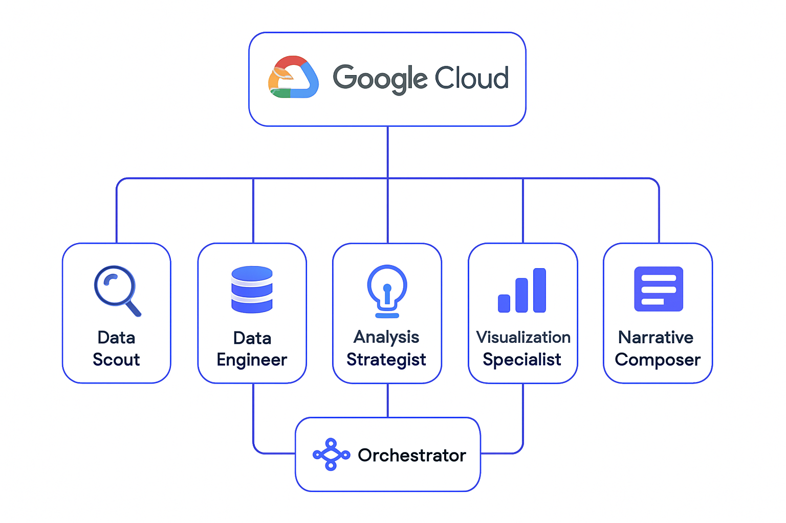

# IntelliFlow

A sophisticated multi-agent data analysis and insights platform built using the Agent Development Kit (ADK) and Google Cloud services.

## Overview

IntelliFlow orchestrates seven specialized AI agents that collaborate autonomously to extract, process, analyze, and visualize data from diverse sources, transforming raw information into actionable business intelligence with minimal human intervention.

## Live Demo

Visit our live demo at: [https://gadda00.github.io/IntelliFlow/](https://gadda00.github.io/IntelliFlow/)

## Architecture

The system consists of the following specialized agents:

- **Data Scout Agent**: Discovers and extracts data from various sources
- **Data Engineer Agent**: Transforms raw data into analysis-ready formats
- **Analysis Strategist Agent**: Determines optimal analytical approaches
- **Insight Generator Agent**: Applies techniques to discover patterns and trends
- **Visualization Specialist Agent**: Creates visual representations of findings
- **Narrative Composer Agent**: Translates findings into business narratives
- **Orchestrator Agent**: Coordinates the entire agent ecosystem



## Technologies

IntelliFlow leverages the following technologies:

### Core Technologies
- **Agent Development Kit (ADK)**: The foundation for creating and orchestrating all specialized agents
- **Google Cloud Platform**: Provides the infrastructure and services that enhance agent capabilities
- **React + TypeScript**: Powers the responsive frontend interface
- **Vite**: Enables fast development and optimized builds

### Google Cloud Services
- **BigQuery**: Powers large-scale data storage and SQL-based analysis
- **Vertex AI**: Enables machine learning model training and deployment
- **Cloud Storage**: Facilitates data staging and result persistence
- **Pub/Sub**: Handles inter-agent communication
- **Cloud Functions**: Supports serverless agent deployment
- **Data Studio**: Enhances visualization capabilities
- **Document AI**: Extracts structured data from unstructured documents
- **Cloud Run**: Hosts containerized agent services
- **Cloud Firestore**: Maintains shared context between agents
- **Cloud Workflows**: Manages complex multi-agent workflows

## Getting Started

### Prerequisites
- Python 3.8+
- Google Cloud SDK
- Agent Development Kit (ADK)
- Node.js 16+ (for frontend)

### Installation

1. Clone the repository:
```bash
git clone https://github.com/gadda00/IntelliFlow.git
cd IntelliFlow
```

2. Install backend dependencies:
```bash
pip install -r requirements.txt
```

3. Install frontend dependencies:
```bash
cd frontend/intelliflow-ui
pnpm install
```

4. Configure Google Cloud credentials:
```bash
gcloud auth application-default login
```

5. Set up configuration:
```bash
cp config/default.yaml config/development.yaml
# Edit development.yaml with your settings
```

6. Run the backend:
```bash
python main.py
```

7. Run the frontend:
```bash
cd frontend/intelliflow-ui
pnpm dev
```

## Documentation

For more detailed information, please refer to the following documentation:

- [Project Summary](docs/project_summary.md)
- [Architecture Diagram](docs/architecture_diagram.md)
- [GitHub Pages Configuration](docs/github_pages.md)
- [Submission Guide](docs/submission_guide.md)

## Example Workflows

The repository includes several example workflows:

- **Customer Feedback Analysis**: Analyzes sentiment and topics from customer feedback data
- **Market Analysis**: Identifies trends and patterns in market data
- **Operational Metrics Analysis**: Monitors and analyzes operational performance metrics

## Contributing

Please read [CONTRIBUTING.md](CONTRIBUTING.md) for details on our code of conduct and the process for submitting pull requests.

## License

This project is licensed under the MIT License - see the [LICENSE](LICENSE) file for details.
